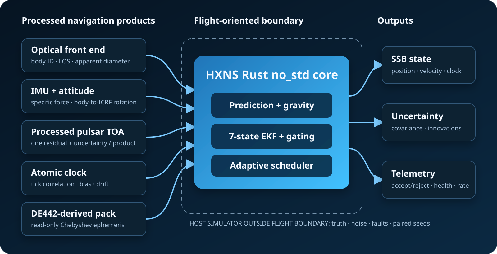

  

<h1 align="center">HXNS</h1>

  <strong>Hybrid XNAV-OpticalNAV Service</strong> 
  A Rust <code>no_std</code> navigation research prototype for inspectable deep-space autonomy.

  Research prototype &nbsp;|&nbsp; Software-in-the-loop &nbsp;|&nbsp; Proprietary core

HXNS fuses processed optical observations, inertial propagation, processed
pulsar time-of-arrival (TOA) measurements, an atomic-clock time correlation,
and a compact DE442-derived ephemeris. The flight-oriented estimator is kept
separate from the host simulator so the same typed navigation boundary can be
exercised in repeatable validation campaigns.

> **Current status:** HXNS is research-grade software-in-the-loop evidence, not
> flight qualification, certified sensor performance, or an operational
> replacement for ground navigation.

> **Product stage:** R0 — Research Evidence Baseline. The transition path is
> `R0 -> external feedback -> R1 -> readiness gates -> C1`. Non-confidential
> sponsored fit checks may be submitted during R0, but C1 delivery is not yet open.

## Architecture

| Boundary | Current implementation |
| --- | --- |
| Embedded core | Rust `no_std`; fixed-size navigation data structures |
| Reference frame | Solar-System Barycentric position using ICRF/J2000 axes |
| Navigation time | Atomic-clock correlation to TDB; CPU wall time is not navigation time |
| Optical products | Identified-body line of sight and apparent-diameter-derived range |
| Pulsar product | One processed TOA residual and uncertainty per integration product |
| Inertial path | IMU propagation between external observations |
| Estimator | Seven-state position, velocity, and clock-bias EKF |
| Output scheduling | Adaptive 1/5/10 Hz navigation output, independent of pulsar cadence |

## Reproducible evidence

The current validation campaign contains:

- **640/640 valid deterministic runs**: 20 paired seeds x 2 sensor profiles x
  4 mission windows x 4 sensor suites.
- **Four bounded mission windows**: near Earth, Earth transition, deep-space
  cruise, and Neptune capture.
- **Four sensor suites**: IMU only, IMU + optical, IMU + pulsar, and full hybrid.
- Standard camera range-bias, camera-occlusion, pulsar-dropout, and IMU-bias
  fault campaigns.
- A processed-pulsar ablation in which the full hybrid reduced run-mean error
  in **150/160** paired comparisons and final error in **148/160** comparisons.
  Worst-error peaks were unchanged in **116/160** comparisons, showing that
  shared transient faults often dominate that metric.

[Open the public validation summary](https://thanatchatharmx-eng.github.io/hxns/samples/sample-validation-summary.html) or
[read the technical preprint](publications/HXNS_Technical_Preprint_EN_v0.3.pdf).

## Customer Evaluation workflow

HXNS Customer Evaluation accepts explicit processed-sensor assumptions without
requiring a customer to edit Rust code. A standard campaign records the exact
configuration and returns:

- standalone HTML report;
- machine-readable JSON;
- per-run and aggregate CSV files; and
- the auditable `.hxns` configuration used for the campaign.

The standard interface covers the four established validation windows. A new
trajectory, body set, camera model, pulsar catalogue, or custom fault schedule
is a scoped feasibility pilot rather than an implied generic feature.

[Review the evaluation boundary](docs/EVALUATION.md) and
[read the FAQ](docs/FAQ.md).

## Technical review and sponsored fit checks

Use the public [technical-review form](https://github.com/thanatchatharmx-eng/hxns/issues/new?template=technical-review.yml)
to volunteer bounded expert feedback. Use the separate
[sponsored-evaluation fit check](https://github.com/thanatchatharmx-eng/hxns/issues/new?template=sponsored-evaluation.yml)
when an organization has a budgeted decision question, wants to explore a
future C1 study, or wishes to fund a defined R&D milestone. A fit check does not
mean that C1 is ready or that work has begun. Sponsored work starts only after
the applicable readiness review, written scope, commercial terms, data
handling, and payment schedule are agreed.

[Read the current sponsored-evaluation brief](publications/HXNS_Sponsored_Evaluation_One_Page_v0.2.pdf).

**Do not include proprietary mission or sensor data in a public GitHub issue.**
A private exchange can be arranged only after scope and fit are established.

## Public/private boundary

This repository is the public technical and customer-facing surface of HXNS.
The flight core, simulator implementation, Customer Evaluation Console source,
full ephemeris pack, and customer data remain in a separate private repository.
No software license is granted by access to these materials; see
[LICENSE](LICENSE).

## Research and contact

- [Research note and validation provenance](docs/RESEARCH.md)
- [Customer Evaluation scope](docs/EVALUATION.md)
- [Frequently asked questions](docs/FAQ.md)
- [GitHub profile](https://github.com/thanatchatharmx-eng)
